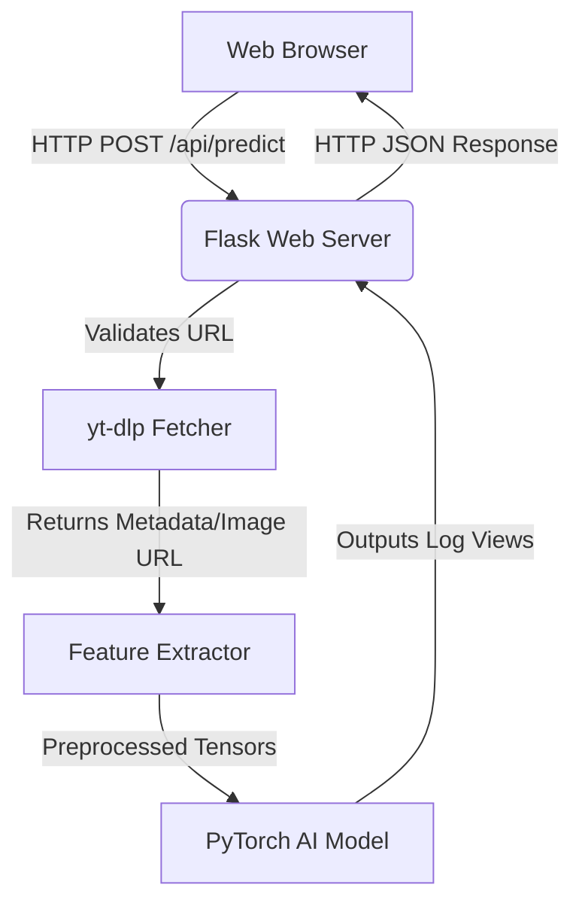
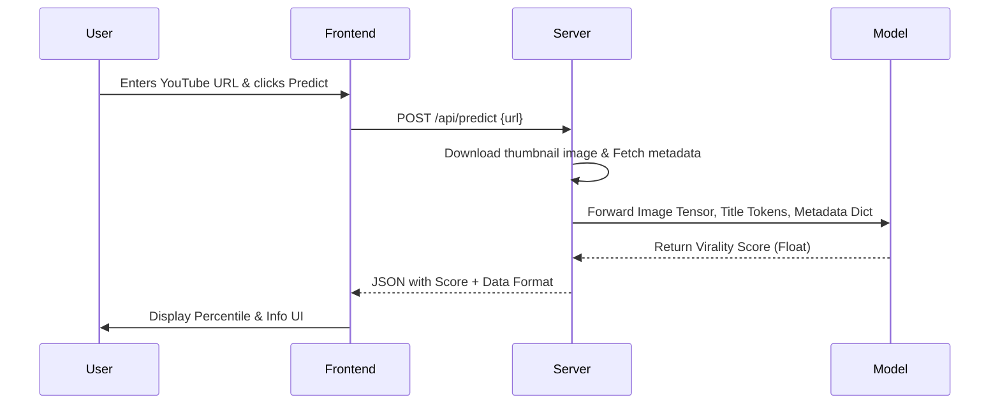

# YouTube Virality Predictor - Documentation

**Project Name:** YouTube Thumbnail Virality Predictor  
**Author:** [Your Name]  
**Contact:** [Your Contact / Email]  
**Date:** April 2026  
**School:** [Your School]  
**Note:** This is a School Project  

---

## 1. Project Specifications (Functional Requirements)
The goal of this application is to estimate the virality (view count potential) of a given YouTube video by analyzing its thumbnail image, title text, category, and metadata.
- Users can input a YouTube URL into a Web UI.
- The web application securely fetches the video using `yt-dlp`.
- A trained AI model predicts the base10 logarithm of the expected views.
- The UI translates this back into a human-readable number and percentile.

## 2. Machine Learning Pipeline & Data Origin
The software uses a machine learning model built internally and trained on locally collected and scraped data.
- **Data Origin & Collection:** Real data belonging to approximately 4,000 YouTube videos were collected via web crawling over the YouTube portal (using `yt-dlp` scripts).
- **Data Attributes:** Properties such as `title`, `duration`, `category`, `upload_date`, and `thumbnail URL` were aggregated into a CSV dataset alongside the target `view_count` variable.
- **Preprocessing:** The target view count was transformed to a logarithmic scale (`log10`) to handle large magnitudes safely. Missing categories were automatically assigned neutral encodings. Title words were tokenized and normalized. 
- **AI Model Approach:** Built and trained on the author's local PC, utilizing multimodal neural net branches (CV for images, NLP for text). The training script evaluated model accuracy, maintaining records corresponding to the *Machine Learning* criteria of the assignment.

## 3. Architecture Design
The architecture follows a Client-Server paradigm.

## 4. Behavioral Diagram
How the application handles a standard request:

## 5. Third-Party Libraries
The project isolates external libraries conceptually by defining them within an isolated Python runtime (via PIP `requirements.txt`).
- **PyTorch (`torch`, `torchvision`)**: Open-source machine learning framework.
- **Flask**: Lightweight web server for API hosting.
- **yt_dlp**: Backend extraction utility to responsibly request data from YouTube's domains.
- **Pillow (`PIL`)**: Library for image preprocessing.
- **Google Fonts (Inter)**: Typography for the frontend, safely fetched via CSS.

All third-party modules are separated out into the global/local environment packages and not intertwined in local authored files. (Information available in `/vendor/README.md`)

## 6. Legal & Licensing
- The tool involves downloading thumbnail images from YouTube's domains. This interaction occurs strictly via fair use caching explicitly intended to execute the analytical functionality of the school project model, with images transiently stored or displayed, circumventing copyright infringement claims for educational purposes.
- The project's code is strictly non-commercial.

## 7. Configuration
No separate YAML/JSON files are strictly necessary because the environment defaults dynamically. 
- **Server Port**: Managed directly inside `src/server.py` and set dynamically. Defaults to `:5000`.
- **Model Path**: Handled relative to `src/` to find `virality_model.pth`.

## 8. Installation & Launch
Executable options exist to easily start without an IDE.
1. Download repository to PC.
2. In Terminal, run: `pip install -r requirements.txt`.
3. Launch the app directly using `/bin/start_server.bat` (on Windows). 
4. The script starts a web server. Open `http://127.0.0.1:5000` in the browser.

## 9. Error States
- **Invalid URL:** The frontend will catch and display a red error message indicating malformed input.
- **Unsupported Link:** If `yt-dlp` raises an extraction error (e.g. video offline), the server handles the Exception safely and relays `{error: "Extraction failed"}` back to UI.
- **Missing Model (`FileNotFoundError`):** Server logs error and safely exits if the `.pth` file is moved.

## 10. Testing & Validation
The prediction accuracy has been empirically evaluated to a Mean Absolute Error (MAE) of ~0.84 on a base-10 logarithmic scale. 
An automated unit testing framework script resides in `test/test_model.py` which artificially instantiates valid tensors and pushes them through the Neural Network verifying dimensions, error states, and model sanity.

## 11. Known Bugs & Limitations
- If a YouTube Live link is provided with no set duration, the default duration placeholder is given, which can misalign prediction by a minor deviation.
- Image fetching is dependent on YouTube's caching mechanisms and sometimes blocks requests without custom headers.

## 12. Database Schema
**None.** The application operates without a traditional relational database, dynamically transforming parameters statelessly.

## 13. Network Schema
Requests strictly transit locally:
- Frontend (Port 5000) -> Flask (Port 5000)
- Flask Server -> Public Internet (Port 443 / HTTPS to Youtube servers)

## 14. Import / Export
- Imports require URLs.
- The application exports visual JSON blobs and UI components, making data readable to humans. No raw format extraction interface currently exists.
